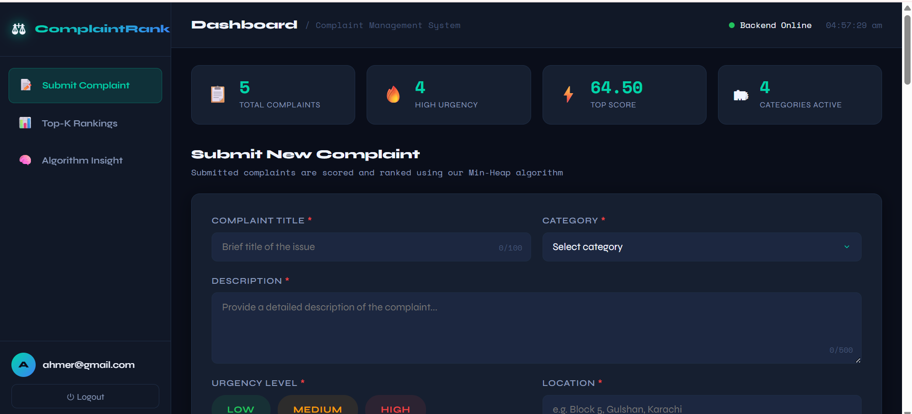
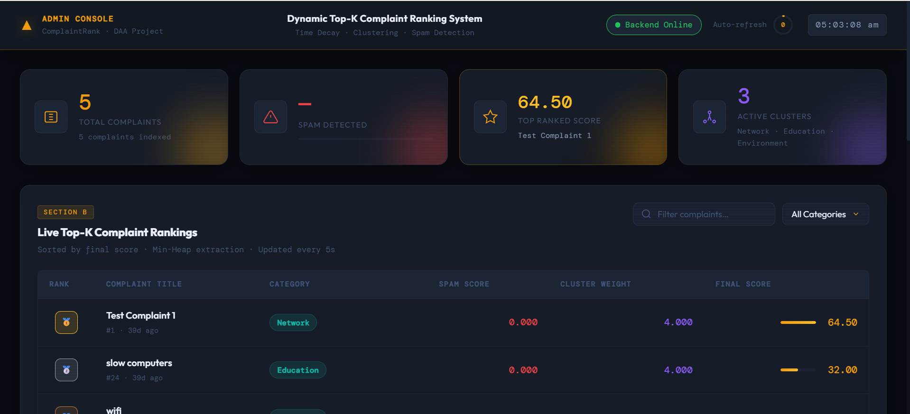
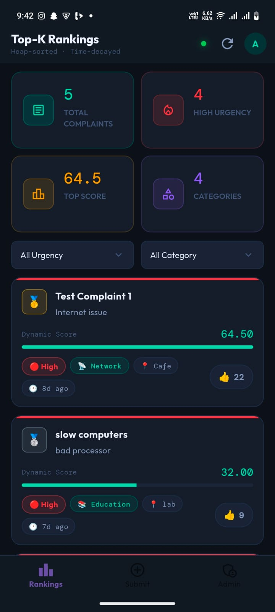
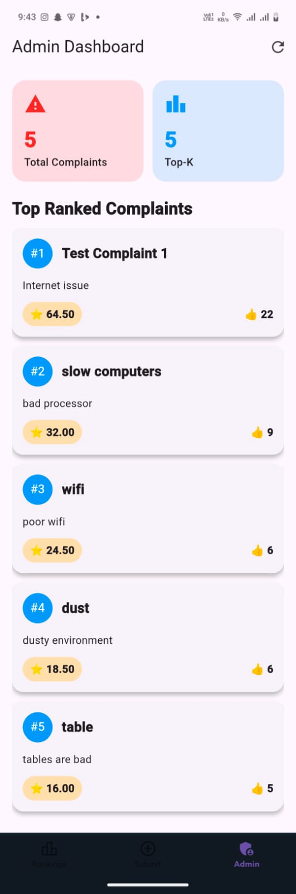
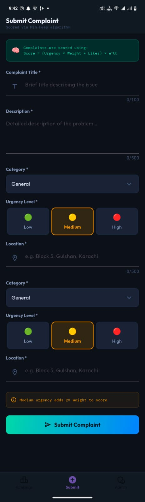
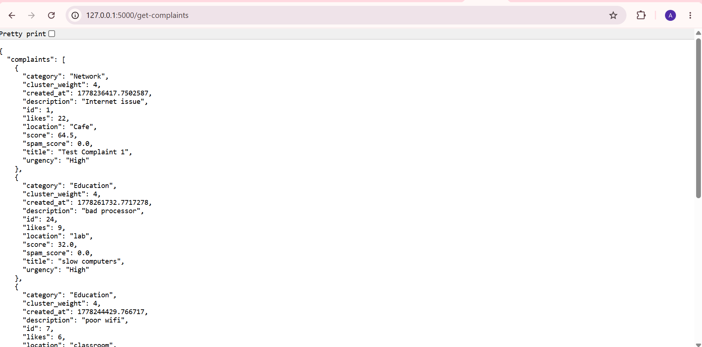

# Dynamic Top-K Complaint Ranking System

A full-stack complaint management platform that dynamically ranks complaints using Data Structures & Algorithms concepts such as Min Heap optimization, time decay ranking, clustering, and spam detection.

## Overview

Universities and organizations receive large numbers of complaints daily. Traditional complaint systems simply store complaints without intelligent prioritization.

This project dynamically maintains the Top-K most important complaints using efficient ranking algorithms and real-time updates.

The system consists of:

* Flask Backend
* SQLite Database
* Web Frontend (HTML, CSS, JavaScript)
* Flutter Mobile Application
* Admin Dashboard
* Dynamic Ranking Engine

---

## Project Highlights

* Implemented Min Heap based Top-K complaint ranking
* Designed dynamic scoring using likes, recency, clustering, and spam penalties
* Built a Flask REST API backend
* Developed responsive Web Dashboard and Admin Analytics Panel
* Integrated Flutter mobile application with backend APIs
* Demonstrated practical applications of Data Structures & Algorithms
* Supports streaming complaint updates and dynamic ranking recalculation


## Key Features

* Dynamic Top-K complaint ranking
* Min Heap / Priority Queue optimization
* Time Decay scoring
* Complaint clustering
* Spam detection
* Like / Upvote system
* Admin analytics dashboard
* REST APIs
* Flutter mobile app integration

---

## Algorithms Implemented

### Top-K Optimization

Uses a Min Heap to maintain the most important complaints efficiently.

Complexity:

O(n log k)

### Time Decay

Older complaints gradually lose ranking importance.

### Clustering

Similar complaints are grouped together to identify recurring issues.

### Spam Detection

Suspicious complaints receive penalties to reduce manipulation.

### Greedy Approximation

Selects highly important complaints while reducing redundancy.

### Submodular Optimization Concept

Models Top-K selection as a diversity-aware optimization problem.

---

## Technology Stack

### Backend

* Python
* Flask
* SQLite

### Frontend

* HTML
* CSS
* JavaScript

### Mobile App

* Flutter
* Dart

---

## System Architecture

```text
Users
   │
   ▼
Web Frontend / Flutter App
   │
   ▼
Flask REST API
   │
 ┌──┼─────────────┐
 │  │             │
 ▼  ▼             ▼
Heap Ranking   Clustering   Spam Detection
 │
 ▼
SQLite Database
```

---

## Screenshots

### Web Dashboard



### Admin Dashboard



### Top-K Rankings


### Algorithm Insights


### Cluster Analytics


### Flutter Dashboard



### Flutter Admin Dashboard



### Flutter Submit Complaint



### API Response



## API Endpoints

### Submit Complaint

POST

```http
/submit-complaint
```

### Get Complaints

GET

```http
/get-complaints
```

### Like Complaint

POST

```http
/like-complaint/<id>
```

---

## Project Structure

```text
backend/
frontend/
flutter_app/
```

---

## Future Improvements

* Machine Learning based spam detection
* NLP clustering
* User authentication
* Cloud deployment
* Push notifications
* Real-time WebSockets

---

## Resume Summary

Developed a full-stack complaint ranking platform that dynamically maintains Top-K complaints using heap-based optimization, time decay scoring, clustering, and spam detection. Built Flask REST APIs, responsive web dashboards, admin analytics, and a Flutter mobile application integrated with the same backend. Demonstrated practical implementation of Data Structures & Algorithms concepts including Min Heap optimization, streaming updates, greedy ranking, and diversity-aware complaint prioritization.


## Author

Ahmer Abbasi

BS Computer Science

COMSATS University Islamabad, Wah Campus
